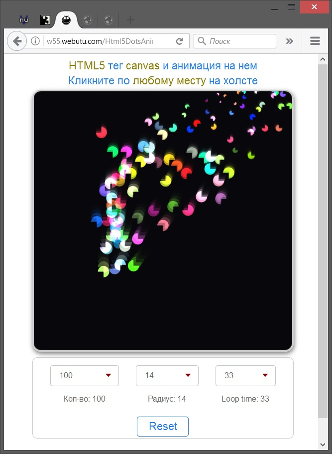

# Html5DotsAnim
<a href="http://htmlbook.ru/html5">HTML5</a> animation example that uses tag <a href="http://htmlbook.ru/html/canvas">canvas</a> and JavaScript to draw on it.
 
This example based on <a href="http://spielzeugz.de/html5/liquid-particles/">liquid-particles</a>.

Take a look: <a href="http://w55.webutu.com/Html5DotsAnim/Html5DotsAnim.html">DEMO PAGE</a>.

This example uses HTML5, CSS3 and JQuery.
